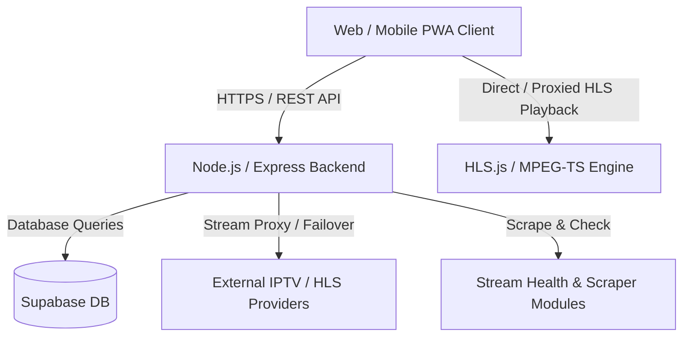

# 📺 StreamFlow V4.0 — Enterprise IPTV & Streaming Platform

StreamFlow is a modern, high-performance IPTV player, live TV streaming, and Video on Demand (VOD) platform built with a microservice-ready architecture. It supports live channels, custom M3U/Xtream Codes playlists, electronic program guides (EPG), stream proxy geo-routing, real-time analytics, and an intuitive user interface for web, desktop, and mobile PWA.

---

## 🚀 Key Features

- 🔑 **Flexible Authentication**: Full authentication system with Email/Password login, Sign Up validation, and **Instant Guest Login** with display names.
- 📡 **Multi-Source IPTV Engine**: Built-in support for global public IPTV sources (`iptv-org`), custom M3U playlists, Xtream Codes API, and raw M3U text pastes.
- 🎬 **Live TV & VOD Movies**: Seamlessly browse live TV channels, movies, and series with auto-detected categories and region/country filtering.
- 📺 **Advanced Video Player**:
  - HLS.js and MPEG-TS stream playback engines with native fallbacks.
  - Automatic stream URL resolver & failover alternate URL switching.
  - One-click launch in external players (VLC, MX Player).
  - Stream proxying for bypassing CORS and ISP restrictions.
- ⭐ **Personalization & History**: Real-time favorite channels, watchlist, and "Continue Watching" history persistence.
- ⚙️ **Admin Control Panel**:
  - Live system metrics, active stream status checks, and analytics charts.
  - Bulk scraper triggers and scraper history tracking.
  - Real-time log monitoring and filter management.
- 📲 **Progressive Web App (PWA)**: Desktop & Mobile installable web application with offline service worker support.

---

## 🏗️ Architecture Overview

StreamFlow follows a decoupled client-server architecture consisting of a high-speed frontend client, a REST API proxy backend, and Supabase for persistent data storage.



### Core Architecture Components

1. **Frontend (`/web`)**:
   - **Framework**: React 18 + Vite + TypeScript
   - **Styling**: Tailwind CSS + Shadcn UI (Enterprise Dark Cyan Theme)
   - **State & Routing**: React Router v6 + Context API (Sidebar & Theme)
   - **Media Engine**: HLS.js + mpegts.js
2. **Backend (`/backend`)**:
   - **Runtime**: Node.js + Express (ES Modules)
   - **Database & Auth**: Supabase PostgreSQL + JWT (JSON Web Tokens) + Bcrypt
   - **Proxy Engine**: Axios / Node stream piping for HLS ts segments & M3U playlists
3. **PWA & Offline**:
   - Service Worker powered by `vite-plugin-pwa` (Workbox) for caching shell assets and fast app loading.

---

## 📁 Repository Directory Structure

```text
streamhub/
├── web/                           # Frontend React (Vite) Web Application
│   ├── src/
│   │   ├── components/            # Reusable UI Components (AppHeader, ChannelCard, HLSPlayer)
│   │   ├── context/               # Sidebar & App Context Providers
│   │   ├── lib/                   # API Client, Utils, and Helper functions
│   │   ├── pages/                 # App Views (Auth, Dashboard, Setup, Settings, Admin)
│   │   ├── App.tsx                # Routing Configuration
│   │   └── main.tsx               # Entry point
│   ├── public/                    # Static Assets (Logos, Icons, Manifest)
│   └── package.json
│
├── backend/                       # Node.js Express REST API Backend
│   ├── config/                    # Supabase Client Configuration
│   ├── middleware/                # JWT Auth & Security Middleware
│   ├── routes/                    # API Route Handlers (auth, iptv, favorites, stream, admin)
│   ├── scrapers/                  # Stream health check & scraping services
│   ├── server.js                  # Express Server Entry Point
│   └── package.json
│
├── SITE_OVERVIEW.md               # Detailed page-by-page overview specification
└── README.md                      # Primary project documentation
```

---

## 🛠️ Local Development Setup

### Prerequisites

- **Node.js**: `v18.x` or higher
- **npm**: `v9.x` or higher

### 1. Environment Configuration

Create a `.env` file inside the `backend/` directory:

```env
PORT=5000
NODE_ENV=development
JWT_SECRET=your_jwt_super_secret_key_here
JWT_EXPIRE=30d
SUPABASE_URL=https://your-supabase-project.supabase.co
SUPABASE_KEY=your_supabase_anon_or_service_key
```

Create a `.env` file inside the `web/` directory (optional for local override):

```env
VITE_API_URL=http://localhost:5000/api
```

### 2. Start the Backend API

```bash
cd backend
npm install
npm run dev
```

The backend server will run on `http://localhost:5000`.

### 3. Start the Web Frontend

```bash
cd web
npm install
npm run dev
```

The frontend development server will launch on `http://localhost:8080`.

---

## 🔌 API Endpoints Reference

### 🔐 Authentication (`/api/auth`)
- `POST /api/auth/register` — Register a new email/password account.
- `POST /api/auth/login` — Authenticate and receive a JWT token.
- `POST /api/auth/guest` — Instant guest login with custom display name.
- `GET /api/auth/me` — Retrieve logged-in user profile.

### 📺 IPTV & Channels (`/api/iptv`)
- `GET /api/iptv/channels` — List channels (with pagination, region, country, search filtering).
- `GET /api/iptv/regions` — Get list of supported regions.
- `GET /api/iptv/categories` — Get channel categories.
- `POST /api/iptv/credentials` — Save user M3U / Xtream credentials.
- `GET /api/iptv/playlist` — Fetch aggregated M3U playlist file.
- `GET /api/iptv/epg` — Fetch XMLTV EPG data.

### ⭐ Favorites & History (`/api/favorites`)
- `GET /api/favorites` — Get user's saved favorite channels.
- `POST /api/favorites` — Add channel to favorites.
- `DELETE /api/favorites/:channelUrl` — Remove channel from favorites.
- `GET /api/favorites/recently-watched` — Get watch history.
- `POST /api/favorites/recently-watched` — Log a watched channel.

### 🌐 Stream Proxy (`/api/stream`)
- `GET /api/stream/proxy?url=...` — Bypass CORS/mixed-content restrictions for live streams.
- `GET /api/stream/resolve?url=...` — Resolve redirect links & final stream URLs.

### 🛠️ Admin (`/api/admin`)
- `POST /api/admin/login` — Admin authentication.
- `GET /api/admin/analytics/summary` — Analytics dashboard metrics.
- `GET /api/admin/channels` — Manage custom IPTV channels.
- `POST /api/admin/streams/health-check` — Health check active streams.

---

## 🐳 Deployment & Containerization

StreamFlow includes pre-configured deployment artifacts for Docker and cloud hosting platforms (Azure App Service, Hugging Face Spaces, Vercel).

### Docker Container Deployment

To build and run the backend via Docker:

```bash
cd backend
docker build -t streamflow-backend .
docker run -p 7860:5000 -e JWT_SECRET="your_secret" streamflow-backend
```

---

## 📄 License

Distributed under the MIT License. See `LICENSE` for details.
